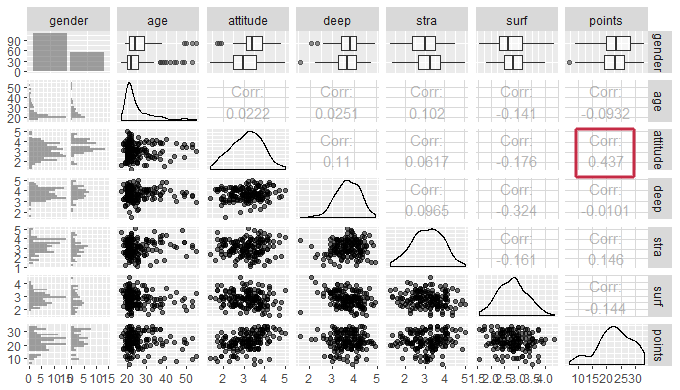
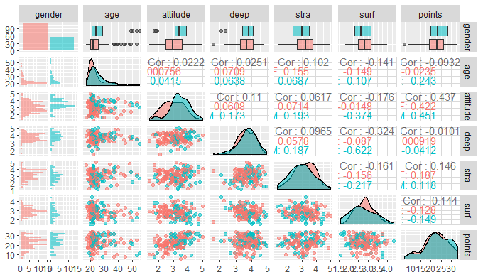
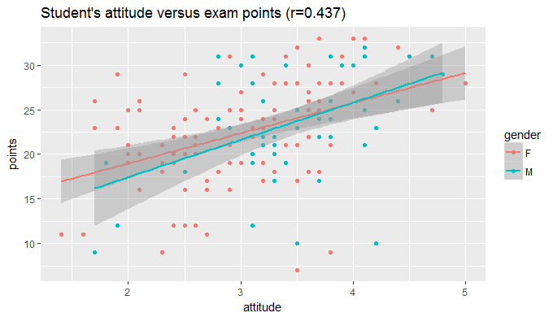
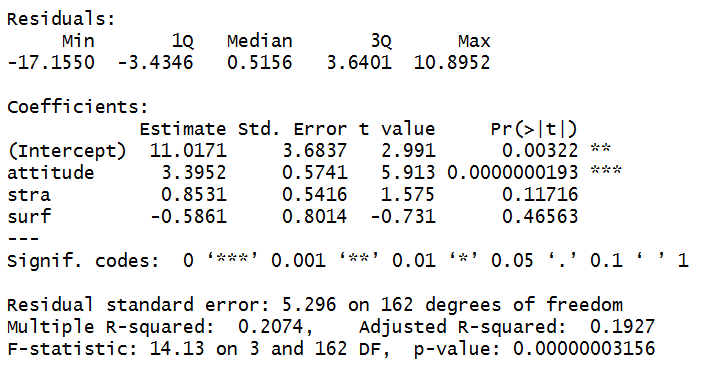
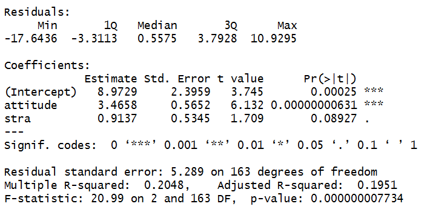
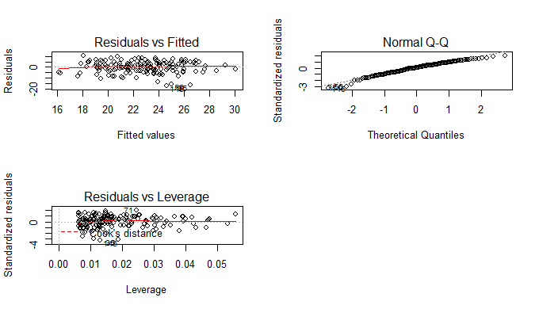

# Regression and model validation

##### I have created a new dataset named 'analysis_dataset' from the dataset 'JYTOPKYS3_data'.  
##### The original dataset contains answers to a survey conducted to the participants of an introductory Statistics course; n=166 (66% female, mean age 25.51 years, SD = 7.8).
##### The following variables were chosen to 'analysis_dataset' for further analysis:

* *gender* (F/M)  
* *age* (in years)  
* *attitude*: an average of answers to 10 questions measuring the student's attitude towards Statistics (Likert scale)  
* *deep*: an average of answers to 12 questions measuring the student's level of deep learning approach (Likert scale)  
* *stra*: an average of answers to 8 questions measuring the student's level of strategic learning approach (Likert scale)  
* *surf*: an average of answers to 12 questions measuring the student's level of surface learning approach (Likert scale)  
* *points*: the student's exam score.  

  
##### Notes:
* In the original dataset the variable 'attitude' was a sum of 10 Likert scale values. In the new dataset, the value 'attitude' has been changed back to average by dividing the values by 10.  
* Observations in the original data, where the exam score ('points') was 0, have been omitted from the new dataset.  

  
##### Data Files:  
* The original dataset (JYTOPKYS3-data.txt) can be found [here](http://www.helsinki.fi/~kvehkala/JYTmooc/JYTOPKYS3-data.txt)  
* The new dataset (analysis_dataset.csv) can be found [here](https://github.com/huttusam/IODS-project/blob/master/data/analysis_dataset.csv)  

##### Script:  
* The R script used to create the new dataset (*with comments explaining the process*) is  [here](https://github.com/huttusam/IODS-project/blob/master/data/create_learning2014.R)  
  
  
  
##### Analysis:

From a scatter plot matrix we can see that the age structure of the students is fairly young, most likely due to the fact that they are university students. Students' attitude towards Statistics (*attitude*) correlates (r=0.437) with students' exam results (*points*), which is not very surprising either. If you like what you study, you tend to get better grades. The same goes with the negative correlation (r=-0.324) between surface and deep learning approaches. Using one means that you don't use the other.
  
***  

  

***  

When male and female students are looked at separately, we can see that the attitude towards Statistics seems to be a bit better among the male than female students. Also, female students seem to use the surface learning approach slightly more than male students.

***    
  
  

***
  
When we create a regression model of *attitude* versus *points*, we can see the correlation between them more clearly.  

  
***

  

***

When we choose *attitude*, *surf* and *strat* as explanatory variables and fit a regression model where exam result (*points*) is the target (dependent) variable, we get the following results:

***  

  

***  

Looking at the values, we can see that *surf* has no statistically significant realtionship with the target variable (*points*). Taking *surf* out of the model produces the following results:

***  
    
  

***  

Multiple R Squared (Finnish: *selityskerroin*):  
The higher the value, the better the independent variables predict the dependent variable. In the above cases, where the R squared is ~ 0,2, the independent variables can explain about 20% of the variation of the dependant variable.
  
The required diagnostic plots, Residuals vs Fitted values, Normal QQ-plot and Residuals vs Leverage, are below. With these images, the validity of the model can be assessed. The first plot (Residuals vs. Fitted) shows that there are no problems in the model, since the reasonably flat line indicates that the linear model is working. In the second plot (Normal Q-Q) the linearity of the points suggests that the data is normally distributed. The third plot (Residuals vs. Leverage) shows that the data has no outliers that would skew the regression results.

***  

  

    
  
  
  